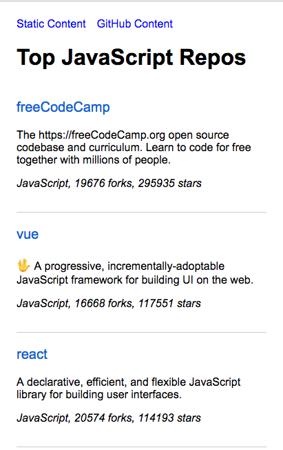

Next.js SSR Demo
================

This application demonstrates Server-side Rendering (SSR) using Next.js.



CSR (client-side rendering) Build
---------------------------------
```bash
$ yarn
$ yarn dev
```

Now point your browser to http://localhost:3000/.

SSR Build
---------
```bash
$ yarn

# Build the client first
$ yarn build

# Start the server
$ yarn start
```

Now point your browser to http://localhost:3000/.
